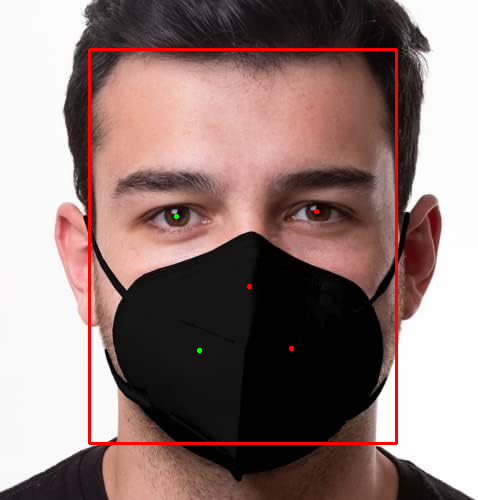
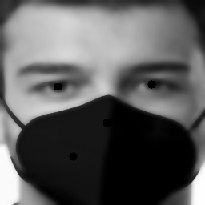
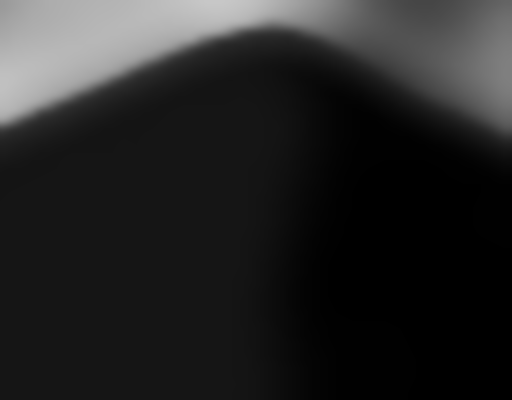
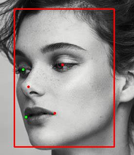

# FaceEval

## Overview
The FaceEval Python package is designed to evaluate face image quality using traditional Computer Vision techniques. It uses RetinaFace model from **insightface** library, specifically the "buffalo_l" model. Using OpenCV and insightface, this package is able to provide quick and accurate evaluation of the face image quality. The upside of using this package is explainability and customizability, where every single threshold and parameter can be edited by the user. This can be demanding but I have already applied strict parameters such that this package can avoid saying that a good image is bad. I reccomend trying it out on a test sample of your own data and carrying out a parameter optimization experiment. Anyway, let's get into the details.

## Features
This algorithm performs the following:
1. **Face Detection with Bounding Box and Key Points**: Using insightface's buffalo_l detector (which is a retinaface model), this package can detect faces in images with GPU-acceleration
2. **Face Shape Quality Checks**: This package evaluates the bounding box and key points to find obvious quality issues for face images these problems are as follows:
    - Bounding box to image ratio: The bounding box cannot be too small or too large in relation to the image size.
    - Image coverage of the bounding box: The bounding box cannot be largerly outside of the image from both x and y axes.
    - Pose analysis: Key points cover both eyes, nose, and both lip corners. Based on the relationships between those points unacceptable poses are flagged. These can be vertical or horizontal.
3. **Face Lighting Quality Checks**: This package evaluates the lighting on a holistic level and on the level of specefic features derived from key points. By creating an intrinsic image as well as creating a Gaussian Image Pyramid depending on the image size and with a specific algorithm for evaluating brightness and occlusion, this package can detect quality problems on the level of facial features. More information about this will be shared in an article regarding this methodology on my website: www.khaledibrahim.site/ai-blog.
4. **Face Count and Image Corruption Handling**: This package is production-ready given the level of logging and error handling it has. It can handle corrputed images and flags images with more than one face.
5. **Parallelizable Implementation**: The FaceEvaluator class can take a device_id parameter which can enable running over multiple GPUs.

## Installation
To get started with TunedLLM, you can install it directly from this GitHub repository using pip.
1. Ensure Git is installed on your system
2. Install faceEval using the following command:
```bash
pip install git+https://github.com/Khaledhamza77/FaceEval
```

## Setup
In the production environment where this is working, this package is able utilize GPU-acceleration using onnxruntime-gpu with the specs of this AWS Deep Learning Container: pytorch-training:2.5.1-gpu-py311-cu124-ubuntu22.04-sagemaker. Further dependecies are included in the requirements file. If there any issues with setup or with getting insightface to utilize GPU using CUDAExecutionProvider, please contact me and I can share with you my conda environment yaml file which covers all other dependencies.

## Demo
### Parameters
Before running the algorithm, let me give a quick explanation of what each of those parameters mean:
1. **d_t**: This is the dark threshold which is the percentage of connected dark pixels in the intrinsic image which indicate a dimmness in holistic lighting
2. **b_t**: This is the bright threshold which is the percentage of connected bright pixels in the intrinsic image which indicate a problematic brightness in holistic lighting
3. **l_bin_size**: This is the lighting bin size, which is the length of the range of pixel values from which the percentage of connected components are calculated in the holistic lighting assessment stage.
4. **v_r**: This is the vertical ratio, which means how much should the upper triangle be bigger/smaller than the lower triangle such that it would indicate the person is looking down/up.
5. **h_r**: This is the horizontal ratio, which means how much should the left triangle be bigger/smaller than the right triangle such that it would indicate the person is looking sideways.
6. **box_l_r**: This is the box large ratio, which is how much bigger than the image should a bounding box be such that it becomes a quality issue.
7. **box_s_r**: This is the box small ratio, which is how much smaller than the image should a bounding box be such that it becomes a quality issue.
8. **occ_range**: This is the occlusion range, which is the length of the range of pixel values from which the percentage of connected components are calculated in the feature-level lighting/occlusion assessment stage.
9. **occ_t**: This is the percentage of connected pixels (compared to all feature-level pixels) within the **occ_range** such that this feature can be considered to be dimly lit or occluded.

### Usage
```python
from faceEval import FaceEvaluator

if __name__ == "__main__":
    img_path = 'path/to/your/image.png'
    evaluator = FaceEvaluator()
    evaluator.run(img_path)
```

### Example
Given an image path, the first step would be detecting the face and identifying the bounding box and key points:



This image is transformed to an intrinsic image using the bilateral filter and grayscaling, for more information about what exactly happens here check the method called get_intrinsic in faceEval/quality/pyramid.py



Afterwards, we can see that the algorithm is able to find occlusions in: Nose and Lips. It outputs the cropped feature-level intrinsic image.



Another Example would be of a horizontal pose, where you can see what I refer to be left and right triangles. If you connect the three leftmost dots you will construct a triangle. The two green points with the nose's red point create the right triangle. Now, in this case, the left triangle was **h_t** bigger than the right triangle as shown below:



## Package Structure
```bash
faceEval/
├── quality/
│   ├── __init__.py
│   ├── evaluate.py
│   └── pyramid.py
├── __init__.py
└── evaluator.py
.gitignore
setup.py
requirements.txt
README.md
```

## Contact Information
For any inquiries or potential contribution please contact me at: khaledhamza@aucegypt.edu